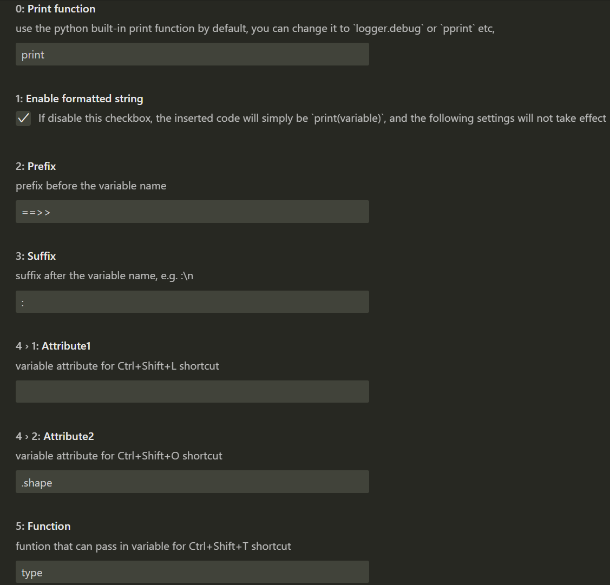
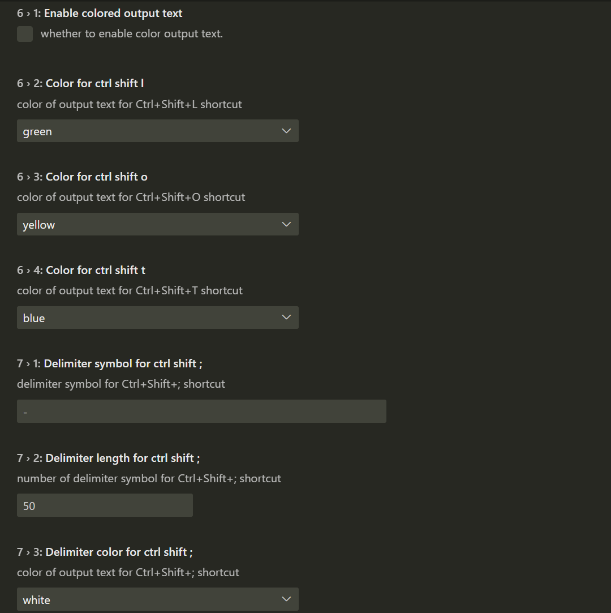

# Quick Python Print

## Intro 
This extension is inspired by "[Python Quick Print](https://github.com/AhadCove/Python-Quick-Print)". "Python Quick Print" can quickly print out variables like `print(f"==>> a: {a}")` on the console by using shortcut `Ctrl+Shift+L`, while "Quick Python Print" enhances some features:
* You can put the cursor at target line, the extension will automatically recognize the variable in the line.
* If did not recognize any variable in current line, it will just insert simply `print()` and move the cursor inside the bracket.
* Press `Ctrl+Shift+O` to print out tensor shape by default, e.g. `print(f"==>> a.shape: {a.shape}")`.
* Press `Ctrl+Shift+T` to print out variable type by default, e.g. `print(f"==>> type(a): {type(a)}")`.
* Press `Ctrl+Shift+;` to insert `print("".center(50, "-"))` used for printing delimiter line.
* Press `Ctrl+Shift+/` to comment out or uncomment all print statement inside the selection or in the file.
* Press `Ctrl+Shift+R` to delete all print statements inside the selection or in the file.
* Allow user to define customized prefix and suffix of print content flexibly in extension settings.
* Able to output colored text in terminal by using python built-in package: `termcolor`.

If you find bug or have feature request, you can check out the ChangeLog to see if this bug or feature had been fixed or added in latest version, if not, please issue it in this extension's [github repo](https://github.com/wwdok/Quick-Python-Print).

## Motivation

When I am learning deep learning model, I often want to know how the tensor shape changes along the way, I think this will help me understand how the deep learning model works. Take pytorh for example, these operations `view，slice，concat，permute，conv，linear` etc all will change the tensor shape. Fortunately, many deep learning framework all have `.shape` attribute of tensor(as far as I know, there are pytorch, numpy, tensorflow, paddlepaddle, oneflow), so this makes the extension be useful for different deep learning framework users. Afterwards, I add more features to make it also useful for other python developers.

## Installation

Before installation, make sure your vscode version ≥ 1.57.0.
Because since version 0.2.0 which use the "[formatted string literals](https://docs.python.org/3/whatsnew/3.6.html#pep-498-formatted-string-literals)" feature introduced since python 3.6, if your python version < 3.6, you can install previous version (e.g. 0.1.9) by:


This extension is available in the Visual Studio Code Extension Marketplace, you can search "Quick-Python-Print" and install it.

## How to use

Introduction video: [Bilibili](https://www.bilibili.com/video/BV1hY411V7bi) | [Youtube](https://www.youtube.com/watch?v=w5cd_8lzylA) (When I made this video, it was version 0.1.1, and there have been many changes in the current version).

This extension only activates within `.py` and `.ipynb` files.

### Keyboard Shortcut

For Mac user, the `Ctrl` should be `Cmd`.

**Note : From version 0.2.0, the inserted code will be a little different, the inserted code will be `print(f"==>> a: {a}")` instead of `print("==>> a: ", a)`.**

**Ctrl+Shift+L**

Select the variable, then press `Ctrl+Shift+L`, it will insert print statement at next line:


You can also just put the cursor at the target line, then the extension will automatically recognize the variable before `=` or `+=` or the unpacked variables separated by `,`:


If you didn't select variable or the extension can't recognize variable, it will just insert simply print() and move the cursor inside it. If selected variable is new defined for the first time, insert code at current line :


If the extension recognize variable wrongly, you can manually select the variable, or report this issue in github repo.

**Ctrl+Shift+O**

`Ctl+Shift+O` is similar to `Ctrl+Shift+L` except that it will print tensor shape by default:


**Ctrl+Shift+T**

`Ctl+Shift+T` is similar to above except that it will print type of variable by default:


**Ctrl+Shift+/**

Comment out or uncomment the print statement in the selected scope or in the python file:


**Ctrl+Shift+Up**

Comment out all print statement above the cursor in the python file:


**Ctrl+Shift+Down**

Comment out all print statement below the cursor in the python file:


**Ctrl+Shift+;**

Insert a print statement that will print 50 `-` to form a delimiter like `--------------------------------------------------`:


**Ctrl+Shift+R**

Delete all the print statement(include those commented) in the python file or in the selected scope:


**Compatibility with different framework**

Many deep learning framework all have `.shape` attribute of tensor:


If any of these shortcuts conflicts with existing shortcut, you may change it in the `Keyboard Shortcuts Setting`: Press `Cmd+P` or `Ctrl+P` and type in `>Open Keyboard Shortcuts`. Search for the conflict shortcut, then you will find those shortcut using the same keys, then right click one of them, modify or delete keybinding.

**Compatibility with other print function**

Some people have the demand to use other print function like loguru's `logger.debug` or logging's `logger.debug` instead of `print`, to achieve this, there is a workaround, that is define a alias name for customized print function, e.g. here is `print = logger.debug`, you can find the discussion in this [issue](https://github.com/wwdok/Quick-Python-Print/issues/2).


### Extension Settings

This extension has following settings:




You can go to the `Extension Settings` to modify them to suit your preferences. After modification, it should take effect immediately.

### Color output text
To color the output text in terminal, you need to do these things:
1. Go to `Extension Settings`, check the `5.enable-colored-output-text` to be true. And you can select the color you like from the drop-down list.
2. Add `from termcolor import colored` in the python file
3. Now Press `Ctrl+Shift+L` or `Ctrl+Shift+O` or `Ctrl+Shift+T` will insert the print statement that can color output text.
4. Run Python File in Terminal.


## pypi package
I also make a pypi package : [printensor](https://github.com/wwdok/print_tensor) to uppack tensors inside list, tuple, dict, generator, then print their tensor shape. After installing and import, you can replace `print(` with `prints(` to intergrate it with this extension.

## Known issue
This extension can not handle tensor that cross multiple lines, for example:
```
a = torch.tensor([[1.0, 2.0, 3.0], 
                [4.0, 5.0, 6.0]])
```
You can use `Alt + down` to move down the inserted print statement.

## Warning
This uses Python 3 syntax,If you're using Python 2 print isn't a function.You can import this behavior from `__future__`:
`from __future__ import print_function`

## Donation
If you find this extension can help you save time, and willing to donate me, i would be very grateful ! ❤

🥤[Buy me a Coca-Cola](https://ko-fi.com/weidawang) 


## License
MIT License
